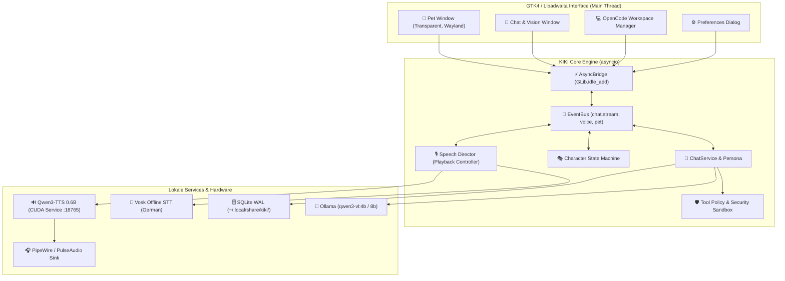

# 🐾 Project KIKI – Freundliches 2D-KI-Desktop-Pet

<div align="center">


### **Dein intelligenter, lokaler KI-Begleiter für Fedora Linux (GNOME / Wayland)**

[](https://python.org)
[](https://fedoraproject.org)
[](https://gnome.org)
[](https://ollama.com)
[](LICENSE)

</div>

---

## 📖 Inhaltsverzeichnis

- [Über Project KIKI](#-über-project-kiki)
- [Charakter-Design & Zustände](#-charakter-design--zustände)
- [Architektur](#-architektur)
- [Schnellstart & Installation](#-schnellstart--installation)
  - [1. Ein-Klick-Installer (Empfohlen)](#1-ein-klick-installer-empfohlen)
  - [2. Manuelle RPM-Installation](#2-manuelle-rpm-installation)
  - [3. Entwicklungsumgebung & Quellcode](#3-entwicklungsumgebung--quellcode)
- [Lokale KI & Sprach-Subsystem](#-lokale-ki--sprach-subsystem)
  - [Lokales Vision-LLM (Ollama)](#lokales-vision-llm-ollama)
  - [Spracherkennung (Vosk STT)](#spracherkennung-vosk-stt)
  - [GPU-Sprachsynthese (Qwen3-TTS)](#gpu-sprachsynthese-qwen3-tts)
- [Feature-Übersicht](#-feature-übersicht)
  - [Desktop-Pet & Interaktion](#desktop-pet--interaktion)
  - [Chat & Vision](#chat--vision)
  - [OpenCode Coding-Agent & Workspaces](#opencode-coding-agent--workspaces)
  - [Sicherheit, Tool-Policy & Panic-Button](#sicherheit-tool-policy--panic-button)
- [Dokumentation](#-weiterführende-dokumentation)
- [Entwicklung & Tests](#-entwicklung--tests)
- [Lizenz](#-lizenz)

---

## 🌟 Über Project KIKI

**KIKI** ist ein 2D-Desktop-Begleiter für Fedora Linux, der direkt auf dem Desktop lebt. Sie bietet:

- **Echte Desktop-Präsenz:** Ein transparentes, interaktiv verschiebbares Wayland-Fenster mit animierten Emotionen und Zuständen.
- **Lokale Privatsphäre:** Vollständig lokales Vision-LLM über Ollama (`qwen3-vl:4b` / `8b`), lokale Offline-Spracherkennung mit Vosk und lokales TTS. Keine Cloud-Pflicht!
- **Sichere Assistenz & Coding:** Integrierter OpenCode-Coding-Agent mit strikter Workspace-Isolation, Git-Root-Schutz und interaktiver Genehmigung.
- **Strikte Sicherheitsarchitektur:** Standardmäßig *Default Deny* für alle Systemaktionen. KIKI führt niemals ungefragt Befehle auf deinem Rechner aus.

---

## 🎨 Charakter-Design & Zustände

KIKI verfügt über zwei kuratierte Design-Packs mit jeweils 12 handgezeichneten und normalisierten Zuständen auf einem 512×512 Canvas:

1. **`kiki-adult-v3` (Standard):** Reifere Silhouette, ruhige und souveräne Ausstrahlung.
2. **`kiki` (Kanonischer Chibi-Stil):** Kompakter Erstentwurf im Anime-Chibi-Look.

<div align="center">

| KIKI v3 (Standard) | KIKI v2 (Canonical Chibi) |
|:---:|:---:|
|  |  |

</div>

### Emotionen & Animations-Zustände

KIKI reagiert visuell auf den Systemzustand und das Gespräch:

| Idle (Warten) | Happy (Freude) | Thinking (Nachdenken) | Speaking (Sprechen) |
|:---:|:---:|:---:|:---:|
|  |  |  |  |
| **Listening (Zuhören)** | **Sleeping (Schlafmodus)** | **Surprised (Überrascht)** | **Error (Fehler)** |
|  |  |  |  |

---

## 🏛 Architektur

Project KIKI trennt die Benutzeroberfläche strikt von der rechenintensiven KI-Logik und den Subprozessen. Dadurch bleibt die GTK4-Oberfläche stets flüssig mit 60 FPS:



Weitere Details zur Architektur und Wayland-Besonderheiten findest du in [docs/ARCHITECTURE.md](docs/ARCHITECTURE.md).

---

## 🚀 Schnellstart & Installation

### 1. Ein-Klick-Installer (Empfohlen)

Für Fedora Linux 44 steht ein vollständiger Ein-Datei-Installer (`.run`) bereit, der Paketintegrität, Abhängigkeiten und Setup automatisch ausführt:

```bash
# Installer ausführbar machen und starten
chmod +x KIKI-0.8.0-Fedora-44-x86_64.run
./KIKI-0.8.0-Fedora-44-x86_64.run
```

Der Installer führt interaktiv durch die optionale Einrichtung von **Ollama**, dem **Vosk-Sprachmodell** und der **OpenCode-CLI**.

---

### 2. Manuelle RPM-Installation

Das native RPM-Paket kann direkt über DNF installiert werden:

```bash
# RPM installieren
sudo dnf install ./dist/kiki-0.8.0-1.fc44.x86_64.rpm

# KIKI aus dem Terminal oder dem GNOME-App-Menü starten
kiki
```

---

### 3. Entwicklungsumgebung & Quellcode

Voraussetzungen auf Fedora 44:

```bash
# System-Abhängigkeiten installieren
sudo dnf install -y \
  rpm-build appstream desktop-file-utils systemd-rpm-macros \
  gdk-pixbuf2 git-core python3 python3-cairo python3-cffi \
  python3-gobject python3-httpx python3-pillow python3-pytest \
  espeak-ng

# Repository klonen
git clone https://github.com/ST1CKEL/Project_KIKI.git
cd Project_KIKI

# KIKI direkt aus dem Quellbaum starten
python3 -m kiki
```

---

## 🧠 Lokale KI & Sprach-Subsystem

### Lokales Vision-LLM (Ollama)

KIKI nutzt standardmäßig **Ollama** mit multimodalen Modellen (Text + Bildverständnis):

```bash
# 1. Ollama installieren & starten
sudo dnf install ollama
sudo systemctl enable --now ollama

# 2. Standard-Modell laden (qwen3-vl:4b)
kiki-setup-model
# Alternativ im Quellbaum: ./scripts/setup-local-model.sh
```

| Modell | Empfohlene Hardware | Einsatzzweck |
|---|---|---|
| **`qwen3-vl:4b`** *(Default)* | ≥ 8 GB RAM / 4 GB VRAM | Schneller Chat, Deutsch, Bildanalyse, OCR |
| **`qwen3-vl:8b`** *(Qualität)* | ≥ 16 GB RAM / 8 GB VRAM | Reifere Persona, tiefere Code- und Planungsfähigkeiten |
| **`gemma3:4b`** | ≥ 8 GB RAM | Exzellentes multilinguales Vision & Reasoning |

---

### Spracherkennung (Vosk STT)

- **Offline & Sicher:** Lokale Spracherkennung über Fedoras Vosk-0.3.50-Laufzeit.
- **Push-to-Talk:** Standardmäßig Leertaste/Button gedrückt halten.
- **Weckwort „KIKI“:** Optional in den Einstellungen aktivierbar.
- **Automatisches Modell-Setup:**
  ```bash
  kiki --prepare-voice-model
  ```

---

### GPU-Sprachsynthese (Qwen3-TTS)

Für lebendige, natürlich klingende deutsche Sprachausgabe nutzt KIKI einen separaten **Qwen3-TTS 0.6B Microservice** (`CustomVoice Serena`):

```bash
# TTS-Dienst einrichten (benötigt CUDA und Python 3.12)
kiki-setup-tts
# Alternativ im Quellbaum: ./scripts/setup-tts.sh

# Fallback: Sollte kein GPU-Dienst aktiv sein, nutzt KIKI automatisch espeak-ng!
```

Ausführliche Latenzanalysen und Architekturdetails: [docs/VOICE_SUBSYSTEM.md](docs/VOICE_SUBSYSTEM.md).

---

## ✨ Feature-Übersicht

### Desktop-Pet & Interaktion
- **Interaktives Bewegen:** Mit gedrückter linker Maustaste frei auf dem Bildschirm verschiebbar (`Gdk.Toplevel.begin_move`).
- **Klick-Durchlässigkeit:** Transparente Bereiche lassen Mausklicks durch, die Figur selbst bleibt interaktiv.
- **Kontextmenü (Rechtsklick):** Schneller Zugriff auf Chat, Einstellungen, Coding-Sessions, Ruhemodus und Beenden.

### Chat & Vision
- **Streaming Markdown:** Formatierter Text, Code-Blöcke mit Ein-Klick-Kopieren, LaTeX-Formeln und Tabellen.
- **Bildschirmfreigabe (Vision):** Screenshot über Wayland XDG Desktop Portal anfordern, um KIKI den Bildschirm oder ein bestimmtes Fenster zu zeigen.
- **Persistenter Verlauf:** SQLite WAL Datenspeicher unter `~/.local/share/kiki/` mit vollständiger Such- und Löschfunktion.

### OpenCode Coding-Agent & Workspaces
- **Workspace-Allowlist:** Exakte Begrenzung auf freigegebene Verzeichnisse mit Symlink-Auflösung und Schutz vor Pfadtraversierung.
- **Plan-First Ansatz:** Der Agent erstellt strukturierte Implementierungspläne vor jeder Code-Änderung.
- **Audit-Log:** Jeder Dateizugriff, Befehl und Subprozess wird revisionssicher protokolliert.

### Sicherheit, Tool-Policy & Panic-Button
- **Default Deny:** Gefährliche Systembefehle (`sudo`, freie Shells wie `sh -c "rm -rf ..."`) sind hart geblockt.
- **Interaktive Genehmigungskarten:** Bei Dateiänderungen oder externen Zugriffen fragt KIKI mit Diff-Vorschau um Erlaubnis.
- **Panic-Button:** Bricht sofort alle laufenden LLM-Streams, TTS-Ausgaben und Hintergrund-Subprozesse ab.

---

## 📚 Weiterführende Dokumentation

- [📘 Benutzerhandbuch (User Guide)](docs/GUIDE.md) – Detaillierte Anleitung für alle Funktionen und Tastaturkürzel.
- [🛠️ Entwicklerhandbuch (Developer Guide)](docs/DEVELOPER_GUIDE.md) – Bauen, Testen, RPM-Paketierung und Erstellung eigener Sprite-Packs.
- [🎙️ Voice Subsystem Architektur](docs/VOICE_SUBSYSTEM.md) – STT/TTS-Pipeline, Streaming-Pufferung und PipeWire-Integration.
- [🏛️ Systemarchitektur & Wayland-Design](docs/ARCHITECTURE.md) – Tiefgehende Architektur- und Sicherheitsdokumentation.
- [🎨 KIKI v2 & v3 Charakter-Design](docs/KIKI_V2.md) – Canvas-Spezifikationen und Animationsclips.

---

## 🧪 Entwicklung & Tests

Die Testsuite umfasst über 720 automatisierte Tests für alle Schichten:

```bash
# Alle Tests ausführen
pytest

# Code-Linting mit Ruff
ruff check src tests

# RPM-Paket und Installer im Projektverzeichnis bauen
./scripts/build-rpm.sh
./scripts/smoke-test-rpm.sh
./scripts/build-fedora-installer.sh
./scripts/smoke-test-installer.sh
```

---

## 📄 Lizenz

Dieses Projekt ist unter der **MIT-Lizenz** lizenziert – siehe die [LICENSE](LICENSE)-Datei für Details.
