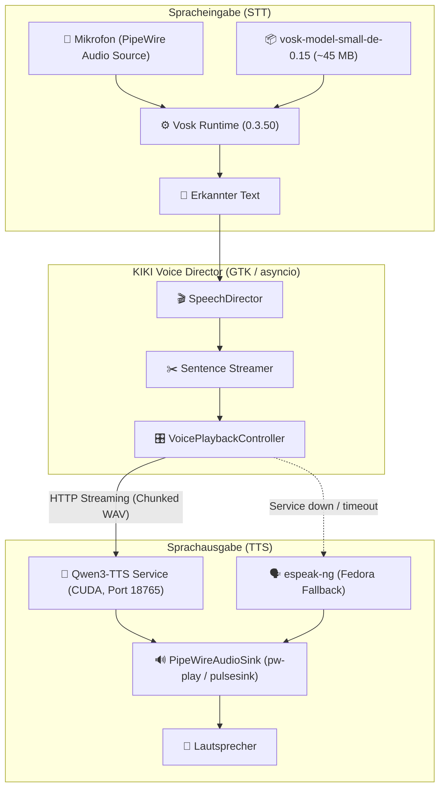

# 🎙️ KIKI Voice Subsystem – Architektur & Technische Dokumentation

Das Sprachsystem von Project KIKI ist modular, lokal und reaktionsschnell aufgebaut. Es besteht aus zwei Hauptsäulen:
1. **Spracherkennung (STT):** Lokale Vosk-Laufzeit mit deutschem Akustikmodell.
2. **Sprachsynthese (TTS):** Separater Qwen3-TTS GPU-Mikrodienst mit Satz-Streaming und sofortiger Abbruchfähigkeit (Barge-in).

---

## 🏛 Gesamte Voice-Pipeline



---

## 🚀 Warum ein eigenständiger Microservice für TTS?

Die Auslagerung des GPU-Synthesizers in einen separaten Microservice (`services/qwen3-tts/`) bietet entscheidende Vorteile:

1. **Kein PyTorch / CUDA im GTK-GUI-Prozess:** 
   GTK4 und Libadwaita bleiben schlank und absturzsicher. PyTorch-Initialisierungen blockieren niemals den Render-Loop.
2. **Loopback-Latenz ist vernachlässigbar (< 1 ms):**
   Messungen auf modernen Systemen (z. B. RTX 5060 Ti / RTX 4070) belegen, dass der HTTP-Transport über `127.0.0.1` weniger als 0,05 % der Gesamtdauer ausmacht.

### ⏱️ Latenz- und Performance-Vergleich

| Komponente | Transport (HTTP Loopback) | KI-Synthese (GPU) | Anteil Transport |
|---|---|---|---|
| **Qwen3-TTS (1. Satz)** | **0,48 ms** | 1.815,00 ms | **0,026 %** |
| **Ollama LLM (1. Token)** | **2,79 ms** | 15.194,00 ms | **0,018 %** |

---

## 🎤 Spracherkennung (Vosk STT)

- **Laufzeit:** Fedoras native C-Bibliothek `libvosk.so` über Python-CFFI.
- **Akustikmodell:** `vosk-model-small-de-0.15` (wird automatisch nach `~/.local/share/kiki/vosk/` geladen).
- **Sicherheitsmerkmale:**
  - Größenbegrenzter Download (max. 100 MB).
  - SHA-256 Checksummen-Validierung beim Auspacken.
  - Atomares Entpacken in temporäres Verzeichnis mit anschließendem Rename.

### Modell manuell vorab herunterladen
```bash
# Nach RPM-Installation:
kiki --prepare-voice-model

# Aus dem Quellbaum:
./scripts/setup-local-model.sh --voice
```

### Sprachverständnis (optionaler faster-whisper-Dienst)

Vosk hört und segmentiert — Weckwort, Äußerungsende und Notfall-Text können nur
aus dem Streamer kommen. Sein Text verhört sich aber bei Eigennamen
(„Thunderbird" wurde als „sander bord" verstanden). Deshalb kann ergänzend ein
zweiter lokaler Dienst laufen:

```bash
kiki-setup-stt        # oder im Quellbaum: ./scripts/setup-stt.sh
```

`kiki-stt` (Port 18775, eigene `stt-venv` mit faster-whisper/ctranslate2)
bekommt die exakte PCM-Passage des erkannten Befehls und schreibt sie ab.
Die App nutzt das Whisper-Transkript, sobald der Dienst antwortet, und fällt
sonst sofort auf den Vosk-Text zurück (30-s-Cooldown nach Ausfall) — kein
Sprachdialog wartet auf den Dienst. Konfiguration: `[voice] stt_service` und
`[voice] stt_fallback_vosk`. Audio verlässt das Gerät dabei nie: Der Dienst
bindet ausschließlich an Loopback.

### Weckwort-Dialog und Follow-up

Das optionale Weckwort bleibt standardmäßig deaktiviert. Ist es eingeschaltet,
öffnet „KIKI“ genau ein lokales Befehlsfenster. Nach der vollständig
ausgegebenen Antwort kann der Listener einmalig direkt weiterhören; Stille bis
zum konfigurierten `command_timeout_s` beendet das Follow-up und schaltet zurück
auf die Weckwortsuche.

Der `FollowUpTurn` verlangt dafür drei Signale: Der Dialog wurde per Weckwort
gestartet, der Assistant-Run ist terminal und seine finale Antwort wurde
ausgegeben. Zwischenansagen für Freigaben, proaktive Hinweise, Begrüßungen und
getippte Chats können deshalb kein Follow-up-Mikrofon öffnen. Der Vosk-Erkenner
bleibt lokal, schreibt kein Audio und verwirft Text außerhalb eines expliziten
Befehls- oder Follow-up-Fensters.

### Kompakte Antwort bei Spracheingabe

Ein mikrofoninitiierter Turn wartet mit TTS bis zur vollständigen Modellantwort.
`plan_voice_answer()` redigiert sie anschließend als Ganzes und begrenzt den
gesprochenen Begleittext standardmäßig auf zwei Sätze beziehungsweise 300
Zeichen. Dadurch wird das Limit genau einmal angewandt und nicht erneut auf
jeden Streaming-Chunk. Der Chat- und Storage-Pfad behält stets den
unveränderten Volltext.

Wurde Text gekürzt oder wegen Code, Logs, URLs, Pfaden, Tabellen oder möglichen
Secrets nicht gesprochen, bringt KIKI den Chat mit der vollständigen Antwort
nach vorn und weist in der Sprachausgabe darauf hin. Normale getippte Chats,
Hinweise und Begrüßungen behalten ihren bisherigen Streaming-Pfad.

---

## 🔊 Qwen3-TTS GPU-Dienst

Der Dienst basiert auf **Qwen3-TTS-12Hz-0.6B-CustomVoice** und erzeugt 24 kHz Audiosignale.

### Dienst-Spezifikationen
- **Endpunkt:** `http://127.0.0.1:18765/synthesize`
- **Standard-Stimme:** `Serena` (klar, freundlich, natürlich)
- **Sprache:** Deutsch (`German`)
- **Streaming-Format:** Unkomprimiertes WAV / PCM-Chunks

### Dienst starten & testen

```bash
# Dienst manuell im Entwicklungsmodus starten
python3 services/qwen3-tts/kiki_tts_server.py --port 18765

# Verbindungstest ohne GPU (Dummy-Modus mit synthetischem Ton)
python3 services/qwen3-tts/kiki_tts_server.py --dummy
```

---

## 🎛️ Streaming & Barge-In (Abbruchkontrolle)

Ein zentrales Feature für natürliche Konversationen ist die Fähigkeit, KIKI jederzeit zu unterbrechen:

1. **Satzweises Streaming:** Sobald das LLM einen Satz fertig generiert hat (z. B. Punkt, Ausrufezeichen), wird er bereits an den TTS-Dienst übergeben, während das LLM noch an den nächsten Sätzen rechnet.
2. **Barge-In Signalisierung:** 
   - Ein Klick auf Stop oder das Absenden einer neuen Nachricht ruft `speech_director.stop()` auf.
   - Der `VoicePlaybackController` sendet ein Cancel-Signal an den HTTP-Stream, leert die Wiedergabewarteschlange und stoppt den PipeWire-Sink.
   - Noch in Berechnung befindliche Audio-Chunks des vorherigen Satzes werden sofort verworfen.
